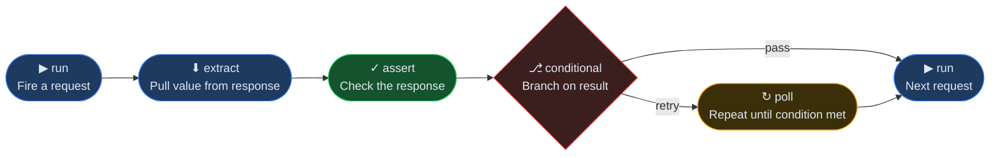

<div align="center"><pre>
██████╗ ███████╗ ██████╗ ██╗  ██╗   ██╗
██╔══██╗██╔════╝██╔═══██╗██║  ╚██╗ ██╔╝
██████╔╝█████╗  ██║   ██║██║   ╚████╔╝ 
██╔══██╗██╔══╝  ██║▄▄ ██║██║    ╚██╔╝  
██║  ██║███████╗╚██████╔╝███████╗██║   
╚═╝  ╚═╝╚══════╝ ╚══▀▀═╝ ╚══════╝╚═╝   
</pre></div>

<p align="center">
  API testing app built for AI agents<br>
  From collections to CI test in one agent session.
</p>

<p align="center"><strong>plain YAML · local-first · MCP server · CLI & Web UI · auto-capture · flows · REST · GraphQL · gRPC</strong></p>

<p align="center">
  <a href="https://www.npmjs.com/package/getreqly"></a>
  <a href="https://github.com/RutvikPansare/Reqly/blob/main/LICENSE"></a>
  <a href="https://github.com/RutvikPansare/Reqly/actions/workflows/ci.yml"></a>
</p>

<p align="center">
  <a href="#installation">Install</a> ·
  <a href="#the-full-zero-human-pipeline">How it works</a> ·
  <a href="#what-your-agent-can-do">MCP Tools</a> ·
  <a href="#flows">Flows</a> ·
  <a href="#faq">FAQ</a>
</p>

Your agent reads your codebase, builds the collection, writes the assertions, exports the GitHub Actions workflow, and ships it to CI. You never touch it.

```bash
npm install -g getreqly
reqly setup
```

<!-- TODO: record demo GIF - agent prompt -> MCP tool fires -> collection appears in sidebar -> run -> response shown -->


**Works with:** [Cursor](https://cursor.com) · [Claude Code](https://claude.com/claude-code) · [Gemini CLI](https://github.com/google-gemini/gemini-cli) · [VS Code](https://code.visualstudio.com) (Claude extension)

### The full zero-human pipeline

```
/goal Read my Express routes, build a collection with assertions, write an
e2e flow for login → checkout, and export it to CI - don't stop until it's green.

1. "Read my Express routes and build a collection with assertions"
        → agent calls create_collection + create_request for every endpoint

2. "Write an e2e flow for the login → checkout path"
        → agent calls create_flow + add_flow_step, runs it, all green

3. "Export it to CI"
        → agent calls export_flow_ci
        → .github/workflows/checkout-flow.yml written automatically
        → installs Reqly, runs the flow, uploads JUnit results as a build artifact
```

In Claude Code, `/goal` keeps the agent working the whole pipeline in one session instead of re-prompting at every step - Reqly's MCP tools are built to be chained that way.

No `bru run` wiring. No manual Actions YAML. No environment setup. One agent session, tests running in CI forever.

Reqly runs locally as a background service with two interfaces from the same engine:
- **MCP server (stdio)** - your agent connects once and gets the full toolkit. Zero UI, zero LLM cost on our side.
- **Localhost web UI** - open `localhost:4242` to browse collections, watch your agent work, fire requests manually.

Collections are plain YAML in `.reqly/` in your repo. Git-native, human-readable, directly writable by agents.

## Table of Contents

- [Installation](#installation)
- [How It Works](#the-full-zero-human-pipeline)
- [MCP Tools](#what-your-agent-can-do)
- [CLI Runner](#cli-runner)
- [Flows](#flows)
- [Exporting Collections](#-exporting-collections)
- [Mock Server](#mock-server)
- [Capture Inbound Requests](#capture-inbound-requests-middleware)
- [Collections and Assertions](#how-collections-work)
- [Proof](#proof-30-seconds)
- [Why Reqly](#why-reqly-beats-postman-insomnia-and-bruno-for-ai-native-developers)
- [Recently Shipped](#recently-shipped)
- [Contributing](#contributing-60-seconds)
- [FAQ](#faq)
- [Star History](#star-history)

## Proof (30 seconds)

**Time savings on real developer workflows:**

| Task | Manual (Postman/Bruno) | Reqly + Agent | Savings |
|------|-----------------------:|--------------:|--------:|
| Scaffold 20 REST endpoints | 45 mins | 2 mins | **95%** |
| Write auth & validation tests | 25 mins | 3 mins | **88%** |
| Chain Login → Checkout flow | 30 mins | 4 mins | **86%** |
| Setup CI Pipeline (GitHub Actions) | 20 mins | 1 min | **95%** |
| **Total onboarding time** | **120 mins** | **10 mins** | **91%** |

Reqly shifts API testing from a tedious manual chore to a rapid, agent-driven workflow. Your agent writes the YAML, constructs the flows, and exports the CI configuration—all without you leaving your editor.

## Why Reqly beats Postman, Insomnia, and Bruno for AI-native developers (45 seconds)

**Collections are plain YAML in your repo.** Every other tool stores collections in a proprietary format or database (Insomnia uses NeDB binary files, Postman locks them behind a cloud account). Reqly's `.reqly/` folder travels with your code via git - readable, diffable, committable. AI agents can read and write collection files directly without any tool calls.

**Reqly is an MCP server, not an MCP client.** Insomnia recently added an MCP client so it can call external tools. Reqly goes further: it *is* the MCP server. Your AI agent in Cursor or Claude Code connects once and gets a full set of tools to fire requests, chain responses, run collections, and verify assertions - no UI required, no extra configuration. The desktop UI (coming soon) is a shell around the same headless engine - the MCP connection stays alive whether the window is open or closed. Other tools built GUI-first have to extract a headless runtime as an afterthought; Reqly was headless from day one.

**Auto-capture, zero manual work.** Reqly can capture outbound traffic from your dev server via a proxy (`reqly exec npm run dev`), inbound traffic via a one-line middleware, and inbound webhooks via a public tunnel - then save everything into collections automatically. No other tool does all three.

**BYOK, no cloud dependency.** There is no Reqly cloud. Collections stay in your repo. Secrets stay in `~/.reqly/config.json` on your machine. The prompt bar in the UI uses your own API key. Nothing is sent to Reqly's servers - because there are no Reqly servers. No account required, no telemetry, no sync.

**Democratizes testing for PMs & QA.** Postman's UI is intimidating for non-developers. With Reqly, non-technical team members can just ask their AI: *"Run the checkout flow and tell me if tax is calculated correctly."* The AI handles the auth, formatting, and JSON payloads, then explains the response in plain English. No developer hand-holding required.

## What an agent session looks like (15 seconds)

```
1. "Read my routes and build a collection" → agent calls create_collection + create_request for each endpoint
2. "Run the collection and check for failures" → agent calls run_collection, assertions pass/fail
3. "Write an e2e flow for the login → checkout path" → agent calls create_flow + add_flow_step, runs it
```

## Installation (45 seconds)

Reqly runs on macOS, Linux, and Windows.

```bash
# On any platform via npm
npm install -g getreqly

# On macOS via Homebrew (CLI only)
brew tap RutvikPansare/reqly
brew install reqly

# On macOS via Homebrew (Desktop App + CLI)
brew install --cask reqly
```

Then wire it up to your AI tool:

```bash
reqly setup
```

This configures Cursor, Claude Desktop, Claude Code, Gemini CLI, and Codex in one shot. To configure a specific tool only: `reqly setup cursor`, `reqly setup claude`, `reqly setup gemini`.

Restart your AI tool, then ask it: "list my Reqly collections".

### Project directory resolution
Reqly determines which project directory to operate on based on a 4-level priority chain:
1. **Flag:** `--project-dir` (highest priority)
2. **Environment Variable:** \`REQLY_PROJECT_DIR\`
3. **Saved Config:** The path set by running \`reqly use <path>\`
4. **Current Directory:** \`process.cwd()\`

**Setup Methods by Host:**
*   **VS Code-based editors (Cursor, Windsurf):** These editors support dynamic macro interpolation. \`reqly setup\` configures them to pass \`--project-dir \${workspaceFolder}\` so Reqly dynamically follows whichever project is currently open in the editor window.
*   **Standalone hosts (Claude Desktop, Gemini CLI, Antigravity):** These tools spawn one global MCP server process that is shared across all projects and do not interpolate macros. \`reqly setup\` omits the flag entirely. For these tools, you **must** run \`reqly use <path>\` inside your project directory to tell the global Reqly process which project to look at.

### Try it in 30 seconds

No API, no agent setup needed yet. Run this in any directory:

```bash
reqly init
reqly start
```

Open `localhost:4242` - you'll have a working collection against [JSONPlaceholder](https://jsonplaceholder.typicode.com) with request chaining, variables, assertions, and a flow already set up. Then connect your agent and ask it to extend it.

## The fastest way to start with your own API (60 seconds)

Don't capture traffic, don't write YAML by hand - just tell your agent to read your code:

```
"Read my Express routes and build a Reqly collection for every endpoint"
```

The agent reads your codebase and calls `create_collection` + `create_request` for each route it finds. No traffic capture needed - it already knows your API from the code.

## What your agent can do (45 seconds)

> Reqly is not an AI - it's an engine for your AI. Connect once, then your agent has the full toolkit.

| | Capability | What it means |
|---|---|---|
| 🗂️ | **Build collections** | Reads your routes, scaffolds requests, no YAML by hand |
| ⚡ | **Fire and assert** | Runs requests, checks status/body/latency, returns pass/fail per assertion |
| 🔗 | **Chain flows** | Multi-step sequences with extract, poll, and conditional branching |
| 📋 | **Validate contracts** | Point at an OpenAPI spec - every response checked automatically |
| 🎭 | **Serve mocks** | Fake a backend from saved examples, no live server needed |
| 🕵️ | **Capture traffic** | Proxy outbound, middleware for inbound, tunnel for webhooks |
| 📤 | **Export collections** | Generate OpenAPI specs, Postman files, or Markdown documentation |

<details>
<summary><strong>View all 30+ MCP tools</strong></summary>

<br>

**🗂️ Collections and Requests**

| Tool | What it does |
|------|-------------|
| `list_collections` | Lists all collections and requests in the project |
| `create_collection` | Scaffolds a new collection |
| `create_request` | Adds a request. Supports `{{variables}}`, assertions, pre/post scripts, script files (`preScriptFile`/`postScriptFile`), auth, multipart bodies |
| `run_request` | Fires a request - returns status, body, headers, latency, assertion results, diff, contract violations |
| `run_collection` | Fires all requests in a collection sequentially |
| `get_response` | Retrieves the last stored response (truncated) |
| `get_response_full` | Retrieves the last untruncated response |
| `export_collection` | Exports as Postman v2.1, OpenAPI 3.0 JSON, or Markdown API Docs |
| `import_collection` | Imports a Postman v2.1 or Bruno collection |

**🌍 Environments and Variables**

| Tool | What it does |
|------|-------------|
| `set_environment` | Changes the active environment |
| `create_environment` | Creates a named environment with variables |
| `set_variable` | Sets a variable on an environment |
| `get_variables` | Lists variables for an environment (with source tags) |
| `delete_variable` | Removes a variable |
| `get_collection_variables` | Lists per-collection variables |
| `set_collection_variable` | Sets a per-collection variable |
| `delete_collection_variable` | Deletes a per-collection variable |
| `set_dotenv_files` | Configures which `.env` files are auto-loaded |
| `get_dotenv_files` | Lists the configured dotenv files |

**🔐 Auth**

| Tool | What it does |
|------|-------------|
| `get_collection_auth` | Gets the default auth config for a collection |
| `set_collection_auth` | Sets Bearer / API Key / Basic / OAuth 2.0 auth for all requests |
| `delete_collection_auth` | Removes collection-level auth |

**📋 OpenAPI Contract Validation**

| Tool | What it does |
|------|-------------|
| `set_collection_spec` | Points a collection at an OpenAPI spec (file path or URL) |
| `get_collection_spec` | Gets the spec config and load status |
| `delete_collection_spec` | Removes the spec from a collection |
| `list_spec_operations` | Lists all operations in the loaded spec |
| `validate_response` | Re-validates the last response without re-firing |

**🔗 Flows**

| Tool | What it does |
|------|-------------|
| `create_flow` | Creates a new flow |
| `get_flow` | Gets a flow's config and steps |
| `list_flows` | Lists all flows |
| `delete_flow` | Deletes a flow |
| `add_flow_step` | Appends a step (run / extract / assert / poll / conditional) |
| `update_flow_step` | Replaces a step in place |
| `delete_flow_step` | Removes a step |
| `run_flow` | Executes a flow and returns per-step results |
| `export_flow_ci` | Generates a GitHub Actions workflow and writes it to `.github/workflows/` |

**🕵️ Capture and Proxy**

| Tool | What it does |
|------|-------------|
| `start_proxy` | Auto-captures outbound traffic into a collection |
| `stop_proxy` | Stops traffic interception |
| `exec_with_proxy` | Starts the proxy and runs a dev command with it injected |
| `install_middleware` | Returns the inbound-capture snippet for your framework |

**🌐 GraphQL**

| Tool | What it does |
|------|-------------|
| `introspect_graphql` | Runs full schema introspection against a GraphQL endpoint; returns structured type/field/arg summary; caches schema for the UI |

**⚡ gRPC**

| Tool | What it does |
|------|-------------|
| `list_grpc_services` | Discovers services from a reflection-enabled gRPC server (no .proto needed); returns `{ services: [{ name }], fileDescriptorCount }` |

`run_request` and `create_request` both support `type: grpc` natively. Place proto files in `.reqly/protos/`. Auth profiles auto-inject into gRPC Metadata.

</details>

## Recently shipped (30 seconds)

- **Markdown Docs Export** - generate beautiful markdown API references directly from your collections
- **Flows** - multi-step automation tests (run, extract, assert, poll, conditional) with data-driven support
- **OpenAPI contract validation** - point a collection at a spec; every response is checked automatically
- **Multipart body editor** - send `multipart/form-data` with file and text parts
- **Response diffing** - detects what changed between runs: status, latency delta, body diff
- **Mock server** - serve saved examples as a real HTTP server for frontend dev and agent testing
- **Pre/post scripts** - per-request sandboxed JS that can read/write env vars before and after the request fires
- **gRPC support** - full BloomRPC-beating gRPC: unary RPCs, server/client/bidirectional streaming, proto-file loading with cross-file import support, server reflection (no .proto needed), auth profiles auto-inject into Metadata, JSON message scaffold auto-generated by `create_request`
- **GraphQL workspace** - dedicated editor with Headers tab, full schema introspection (with cache), Docs Explorer sidebar, a Saved Requests browser, operationName multi-op dropdown, `queryFile` support for external `.graphql` files, Prettify, Copy as cURL, GraphQL-aware response viewer (data/errors/extensions sections), and real-time subscription streaming via graphql-ws
- **cURL import** - paste any cURL command; fields populate instantly
- **TypeScript interface generator** - infers a typed TS interface from any JSON response body
- **.env integration** - zero-config: if `.env` exists at the project root it's loaded automatically

## Flows (60 seconds)

Flows are multi-step sequences your agent builds once and CI runs forever. Each step chains into the next - extract a value from one response and inject it into the next request automatically.



**Example: login → create post → verify it exists**

```yaml
# .reqly/flows/e2e-post.yaml
steps:
  - type: run
    request: auth/login

  - type: extract
    from: response.body.token
    into: authToken          # now available as {{authToken}}

  - type: run
    request: posts/create-post

  - type: extract
    from: response.body.id
    into: postId

  - type: assert
    field: status
    operator: eq
    value: 201

  - type: run
    request: posts/get-post  # uses {{postId}} in the URL

  - type: assert
    field: body
    path: post.title
    operator: eq
    value: "Hello world"
```

Run it:

```bash
reqly run-flow "e2e-post"
reqly run-flow "e2e-post" --reporter json
reqly run-flow "e2e-post" --data-row '{"userId":"42"}'
```

Export to CI in one command:

```bash
reqly export-flow "e2e-post" --format github-actions
# Writes .github/workflows/e2e-post.yml - installs Reqly, runs the flow, uploads JUnit results
```

Agents can do the same via the `export_flow_ci` MCP tool - no manual YAML writing.

## 📤 Exporting Collections (30 seconds)

**You are never locked into Reqly.** Because your collections are plain YAML files, you always own your data. To make migration even easier, Reqly provides built-in, freeform export formats to move your collections into other tools, documentation sites, or API gateways instantly:

* 📮 **Postman (`postman`)**: Exports a standard Postman v2.1 JSON file. Perfect for importing directly into Postman, Insomnia, or other HTTP clients.
* ⚙️ **OpenAPI (`openapi`)**: Generates an OpenAPI 3.0 JSON specification. Ideal for Swagger UI, generating client SDKs, or configuring API gateways.
* 📖 **Markdown Docs (`docs`)**: Generates a beautiful Markdown (`.md`) API reference ready to be committed to your repository, wiki, or static site generator.

**Via CLI:**
```bash
reqly export docs my-collection
reqly export docs my-collection --output docs/api/my-collection.md
```

**Via AI Agents:**
It's as simple as asking your agent. They can automatically export your APIs by calling the `export_collection` MCP tool:
```
"Export my 'users' collection to a Postman file so I can share it with the frontend team."
```

## Capture Inbound Requests (Middleware) (45 seconds)

If your codebase is too complex or undocumented for the AI-writes-collection workflow, install `reqly-middleware` to capture every request coming **into** your app automatically:

```bash
npm install reqly-middleware
```

```ts
// Express
import { reqlyMiddleware } from 'reqly-middleware'
app.use(reqlyMiddleware())

// Next.js (middleware.ts at project root)
import { reqlyNextMiddleware } from 'reqly-middleware/next'
export default reqlyNextMiddleware()

// Fastify
import { reqlyMiddlewareHook } from 'reqly-middleware'
fastify.addHook('onRequest', reqlyMiddlewareHook())
```

Restart your dev server and Reqly starts capturing inbound requests into the `Captured` collection. Local development only - it phones home to `localhost:4242` and has no effect in production. Ask your agent to call `install_middleware` to get the exact snippet for your framework.

## How collections work (30 seconds)

Collections live in `.reqly/` inside your project directory as human-readable YAML files. They support variables, authentication profiles, and test assertions.

Example request YAML:
```yaml
name: create-user
method: POST
url: "{{baseUrl}}/api/users"
headers:
  Content-Type: application/json
body:
  email: test@example.com
assertions:
  - field: status
    operator: eq
    value: 201
  - field: body
    path: user.id
    operator: neq
    value: ""
```

## Assertions (45 seconds)

Assertions run automatically after every request execution. Each assertion checks one thing:

| Property | Values | Notes |
|----------|--------|-------|
| `field` | `status` \| `body` \| `latency` | **Required.** Use `field`, not `type`. |
| `operator` | `eq` \| `neq` \| `contains` \| `lt` \| `gt` | **Required.** |
| `value` | string, number, or boolean | **Required.** Expected value. |
| `path` | dot-notation string | Required when `field` is `body`. Path into the JSON body, e.g. `user.id` or `data.items.0.name`. |

**Common mistake:** writing `type: "status"` instead of `field: "status"` - this silently produces an assertion that never matches, always failing with "got undefined".

Examples:
```yaml
assertions:
  - field: status       # HTTP status code
    operator: eq
    value: 200

  - field: body         # JSON body field at path
    path: user.active
    operator: eq
    value: true

  - field: latency      # response time in ms
    operator: lt
    value: 2000
```

## CLI Runner (45 seconds)

You can use Reqly in your terminal or CI/CD pipelines to run test suites.

```bash
reqly run users
```

Supports reporter formats and environments:
```bash
reqly run users --env prod --reporter json
reqly run users --reporter tap
reqly run users --reporter junit > results.xml
```

`--reporter junit` writes a standard JUnit XML `<testsuite>`/`<testcase>` document to stdout - redirect it to a file for your CI to pick up. Each assertion on a request becomes one `<testcase>`; a request with no assertions is one implicit testcase that fails only if its status is >= 500.

### Running Flows

```bash
reqly run-flow "Login Flow"
reqly run-flow "Login Flow" --reporter json
reqly run-flow "Login Flow" --reporter tap
reqly run-flow "Login Flow" --reporter junit > results.xml
reqly run-flow "Signup Flow" --data-row '{"email":"test@example.com"}'
```

### Exporting flows to CI

```bash
reqly export-flow "Login Flow" --format github-actions
```

Writes `.github/workflows/Login Flow.yml` (creates the directory if needed) that installs Reqly, starts it, runs the flow with `--reporter junit > results.xml`, and uploads `results.xml` as a build artifact on push and pull request. Add a "Start server" step before "Run flow" if the flow hits a local API.

Want your agent to re-check the API on a cadence instead of only on push? In Claude Code:
```
/schedule every morning at 9am, run reqly run-flow "Login Flow" --reporter junit and tell me if anything broke
```

### Mock server

Serve saved example responses as a real HTTP server so frontend code or agents can make calls against controlled responses without a live backend:

```bash
reqly mock <collection>           # default port 4243
reqly mock <collection> --port 5000
```

On start, Reqly prints a table of all active routes (method, path, example count). Press Ctrl+C to stop.

To select a specific example per request, set the `X-Reqly-Example: <name>` header. Without it, the first saved example is served.

The mock server also exposes REST routes on the main server (port 4242) for UI and programmatic control:

```
POST /api/mock/start   { collection, port? }
POST /api/mock/stop
GET  /api/mock/status
```

## Contributing (60 seconds)

Reqly is an open-source execution engine built for AI agents. We welcome contributions across the stack! 

### How you can help
- **Engine & Protocols:** Add support for new auth types (AWS Signature v4, Digest, NTLM) or enhance the JS script sandbox with more built-in helper libraries (e.g., mock data generation).
- **MCP Toolkit:** Write new tools in `src/mcp/tools/` (e.g., importers for Swagger 2.0 or Insomnia) to give agents more capabilities.
- **UI & Polish:** Enhance the React frontend (`src/ui/`) with themes, better syntax highlighting, or UI fixes.

### Core Architectural Principle: Tool-First
**Every capability must be a tool first.** If it can't be called via MCP, it doesn't exist as a feature. The UI is a visual wrapper around the same tools - it never has capabilities the MCP interface lacks. Keep AI logic *outside* the engine; Reqly is the dumb execution layer for smart agents.

### Local Setup
```bash
git clone https://github.com/RutvikPansare/Reqly.git
cd Reqly
npm install
npm run dev
```

### Testing Standards
We use Vitest (`npm test`). **Engine logic (`src/engine/`) and MCP tool contracts (`src/mcp/`) require strict TDD** with 100% coverage. UI interactions are tested flexibly. Before submitting a PR, ensure all tests pass.

## FAQ

<details>
<summary><strong>Do I need an AI agent to use Reqly?</strong></summary>
<br>
No. The localhost UI at <code>localhost:4242</code> works standalone - create collections, fire requests, inspect responses, all without an agent. The MCP interface is additive: when your agent is connected, it gets the same capabilities via tools. You can use both at the same time.
</details>

<details>
<summary><strong>How is this different from Postman or Insomnia?</strong></summary>
<br>
Three things:

1. <strong>Collections are YAML files in your repo</strong>, not locked in a cloud account or proprietary binary format. They travel with your code via git, your agent can read and write them directly, and you can diff them in a PR.
2. <strong>Reqly is an MCP server</strong>. Your AI agent connects to it and gets a full toolkit - fire requests, run flows, validate contracts - without opening a UI. Postman and Insomnia are UI-first; Reqly is agent-first.
3. <strong>No cloud dependency, ever.</strong> No account required, no sync, no telemetry. Everything runs on your machine.
</details>

<details>
<summary><strong>How is this different from Bruno?</strong></summary>
<br>
Bruno is the closest comparison - it's also local, file-based, and git-native. The key difference is the agent interface. Bruno has no MCP server; your agent can't call Bruno tools to fire requests or build collections programmatically. Reqly was designed from day one so that an AI agent is the primary user, with the UI as a secondary window into the same engine.
</details>

<details>
<summary><strong>Does Reqly send any data to the cloud?</strong></summary>
<br>
No. Reqly is a local process. Collections stay in <code>.reqly/</code> in your repo. Your API keys stay in <code>~/.reqly/config.json</code> on your machine. The prompt bar in the UI sends requests to your own API key directly from your browser - nothing routes through Reqly's servers, because there are no Reqly servers.
</details>

<details>
<summary><strong>Can I use Reqly without Cursor or Claude Code?</strong></summary>
<br>
Yes. Any MCP-compatible client works: Cursor, Claude Code, Claude Desktop, Gemini CLI, Codex, or anything that supports the MCP stdio transport. If your agent doesn't support MCP yet, you can still use the CLI (<code>reqly run</code>, <code>reqly run-flow</code>) and the localhost UI without any agent at all.
</details>

<details>
<summary><strong>macOS says the desktop app "cannot be opened because the developer cannot be verified" - is this safe?</strong></summary>
<br>
Yes. The Reqly desktop app ships unsigned for now (no Apple Developer account yet) - this is macOS Gatekeeper's standard warning for any unsigned app, not a sign of anything wrong. Right-click the app, choose <strong>Open</strong>, then <strong>Open anyway</strong> in the dialog. This is a one-time step per machine. Installing via the Homebrew cask bypasses this warning entirely.
</details>

<details>
<summary><strong>Windows SmartScreen says "Unknown publisher" when I run the installer - is this safe?</strong></summary>
<br>
Yes. The installer is unsigned for now (no EV certificate yet) - this is SmartScreen's standard warning for any new, low-download installer. Click <strong>More info</strong>, then <strong>Run anyway</strong>. The warning disappears automatically once the installer accumulates enough download reputation. Binaries are still signed with Sigstore/cosign for tamper-evidence even without SmartScreen trust.
</details>

<details>
<summary><strong>I installed the desktop app but it says "Reqly CLI not found" - what do I do?</strong></summary>
<br>
The desktop app is a launcher and window around the same <code>reqly</code> CLI server - it doesn't bundle Node or the server itself. Install the CLI globally first: <code>npm install -g reqly-app</code>, then reopen the desktop app.
</details>

<details>
<summary><strong>My agent is looking for collections in the wrong directory. What do I do?</strong></summary>
<br>
This happens when your AI tool launches the Reqly process from a different working directory than your project. Fix it one of three ways:

1. <strong>Cursor / most editors</strong> - run <code>reqly setup cursor</code> again from inside your project directory. The setup command writes <code>${workspaceFolder}</code> into the MCP config so Cursor passes the right path at launch.
2. <strong>Claude Desktop</strong> - run <code>reqly use /path/to/your/project</code> to set the active project globally, then restart Claude Desktop.
3. <strong>Manual override</strong> - set the <code>REQLY_PROJECT_DIR</code> environment variable on the MCP server entry in your AI tool's config.
</details>

<details>
<summary><strong>Can I use Reqly in CI without an AI agent?</strong></summary>
<br>
Yes - that's the point of <code>reqly run</code> and <code>reqly run-flow</code>. Your agent builds and maintains the collection locally; CI just executes it. Use <code>--reporter junit</code> to get JUnit XML output that GitHub Actions, GitLab CI, and Jenkins parse natively into test dashboards.

```bash
reqly run my-collection --reporter junit > results.xml
```

Or generate the full GitHub Actions workflow automatically:

```bash
reqly export-flow "my-flow" --format github-actions
```
</details>

<details>
<summary><strong>Does the middleware capture requests in production?</strong></summary>
<br>
No - by design. <code>reqly-middleware</code> phones home to <code>localhost:4242</code> and is a silent no-op if Reqly isn't running. It will never capture traffic in a production environment where Reqly isn't present, and it never buffers or delays your requests (fire-and-forget, errors swallowed).
</details>

<details>
<summary><strong>What auth types does Reqly support?</strong></summary>
<br>
Bearer token, API Key (header or query param), Basic auth, and OAuth 2.0 with PKCE. Auth can be set at the collection level (applies to all requests) or overridden per-request. Your agent can configure auth via the <code>set_collection_auth</code> MCP tool - no manual YAML editing required.
</details>

<details>
<summary><strong>Can I import my existing Postman or Bruno collections?</strong></summary>
<br>
Yes. Reqly imports Postman v2.1 collections and Bruno collections out of the box:

```bash
reqly import postman-collection.json
reqly import bruno-collection/
```

Or via the MCP tool: your agent can call <code>import_collection</code> and pass the file path. Reqly also exports to Postman v2.1 and OpenAPI 3.0 if you need to go the other way.
</details>

<details>
<summary><strong>How do environment variables work?</strong></summary>
<br>
Reqly has three variable layers, resolved in this order:

1. <strong>.env files</strong> - auto-loaded from your project root (or configured via <code>set_dotenv_files</code>)
2. <strong>Environment variables</strong> - named sets like <code>dev</code>, <code>staging</code>, <code>prod</code>, stored in <code>.reqly/environments.yaml</code>
3. <strong>Collection variables</strong> - scoped to a single collection, useful for values like <code>baseUrl</code>

Use <code>{{varName}}</code> anywhere in a URL, header, or body. Switch environments with <code>reqly run --env prod</code> or via the UI dropdown.
</details>

<details>
<summary><strong>Does Reqly support GraphQL?</strong></summary>
<br>
Yes. The UI has a dedicated GraphQL workspace with schema introspection, syntax highlighting, and a variables panel. GraphQL requests are stored in collections the same as REST - your agent can create and run them via the same MCP tools.
</details>

<details>
<summary><strong>Can I run Reqly on a team? How do we share collections?</strong></summary>
<br>
Collections are plain YAML files in <code>.reqly/</code> inside your project repo. Sharing is just git - commit the folder and everyone on the team has the same collections. There's no account, no workspace invite, no cloud sync required. Secrets and API keys are stored in <code>~/.reqly/config.json</code> locally on each developer's machine and are never committed.
</details>

<details>
<summary><strong>What Node.js version does Reqly require?</strong></summary>
<br>
Node.js 18 or later. Reqly uses native <code>fetch</code>, ES modules, and the MCP SDK which all require Node 18+. Check your version with <code>node --version</code>.
</details>

<details>
<summary><strong>Port 4242 is already in use. Can I change it?</strong></summary>
<br>
Yes. Pass <code>--port</code> when starting:

```bash
reqly start --port 4243
```

Or set it in your MCP config args. The UI will open on whichever port you choose.
</details>

<details>
<summary><strong>How do pre/post scripts work?</strong></summary>
<br>
Each request can have a <code>preScript</code> and a <code>postScript</code> - small sandboxed JavaScript snippets that run before and after the request fires. They have access to a <code>reqly</code> object with methods to read and write environment variables:

```js
// preScript - set a dynamic header before the request
reqly.setEnvVar('timestamp', Date.now().toString())

// postScript - extract a value from the response into an env var
const token = reqly.response.body.access_token
reqly.setEnvVar('authToken', token)

// You can also use reqly.setVar(key, val) / reqly.getVar(key) to store collection-scoped variables in memory
```

Scripts run in an isolated context with no filesystem or network access - they can only interact with Reqly's variable store and the response object.

For longer scripts, use `preScriptFile` / `postScriptFile` instead - set the value to a path relative to the collection folder (e.g. `"scripts/post.js"`). Reqly reads the file at run time, so you can edit it without touching the YAML. No JSON escaping required.

```js
// create_request({ postScriptFile: "scripts/post.js", ... })
// then edit .reqly/<collection>/scripts/post.js freely
```
</details>

<details>
<summary><strong>How do I stop Reqly?</strong></summary>
<br>

```bash
reqly stop        # stops the running instance
reqly status      # check if an instance is running and which project it's on
reqly app         # opens the running instance's UI in your browser
```

Or press Ctrl+C in the terminal where Reqly is running. Reqly writes a lock file at <code>~/.reqly/running.json</code> to track the running instance - <code>reqly stop</code> reads this to find and signal the process.
</details>

<details>
<summary><strong>Can I switch projects without restarting?</strong></summary>
<br>
Yes. If a Reqly instance is already running, starting a new one in a different project directory hot-swaps the active project without restarting the server:

```bash
cd /path/to/other-project
reqly start
# "Switched active project to /path/to/other-project"
```

The new process hands off to the existing instance and exits. The MCP connection stays alive and immediately sees the new project's collections.
</details>

<details>
<summary><strong>Is there a way to test webhooks?</strong></summary>
<br>
Yes - use the tunnel command to expose your local server to the internet and capture incoming webhook payloads:

```bash
reqly exec --tunnel npm run dev
```

This starts your dev server with a public HTTPS URL. Any requests hitting that URL are proxied to your local server and saved into the <code>Captured</code> collection automatically.
</details>

## Star History

[](https://star-history.com/#RutvikPansare/Reqly)
